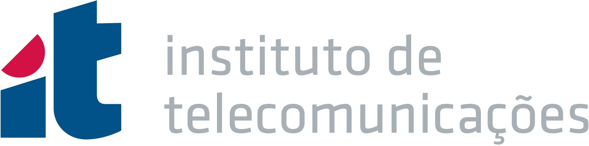

---
---

# Welcome to the **S**ensors and **A**dvanced mixed-si**G**nal p**R**ocessing **E**lectronic **S**ystems **LAB**

**SAGRES** develops next-generation sensing and electronic systems that bridge fundamental research and real-world applications. Our research spans electromagnetic sensors, discrete and microelectronic sensor interfaces, mixed-signal processing and embedded electronics systems. We combine expertise in sensor design, electronics, and signal processing to develop innovative measurement solutions for industrial quality control, environmental monitoring, and other emerging applications.

SAGRES is a research laboratory at **Instituto Superior Técnico**, one of Europe's leading engineering schools. Our research activities are supported by **Instituto de Telecomunicações**, one of Portugal's leading research institutes in electrical engineering and information technologies.

    

    

We are a team of researchers and engineers dedicated to designing, building, and experimentally validating advanced sensing and electronic technologies. Our work is hands-on, spanning the entire development cycle from concept and simulation to prototype implementation and experimental validation. Beyond scientific research, we are committed to translating our results into practical impact through industrial collaborations, patents, and spin-off creation.



## News







## Why SAGRES?

SAGRES pays tribute to the symbolic <a href="https://www.google.com/" style="color: black; font-weight: bold; text-decoration: underline; text-decoration-style: dotted;">Sagres School</a>. It represents the spirit of scientific curiosity, engineering excellence, and interdisciplinary collaboration that enabled Portugal during the Age of Maritime Discoveries.

Our laboratory shares this vision by developing advanced sensing technologies through an interdisciplinary approach. We combine expertise in sensors, electronics, and signal processing with collaborations across engineering, physics, chemistry, environmental sciences, and other disciplines to address complex scientific and technological challenges.

